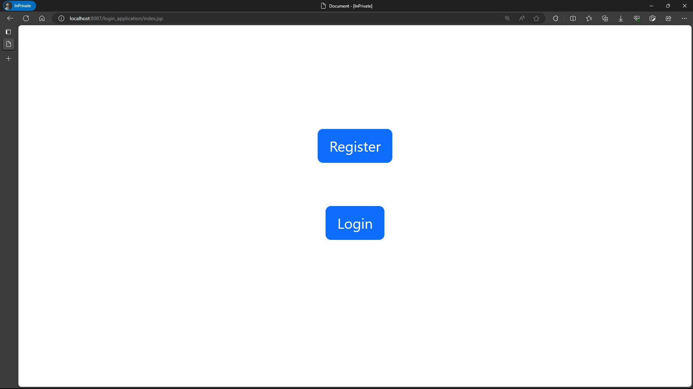
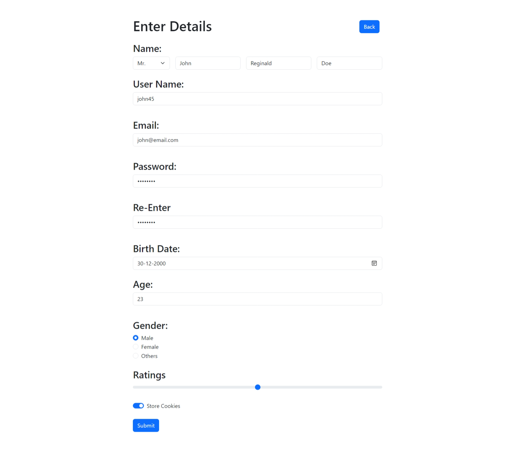
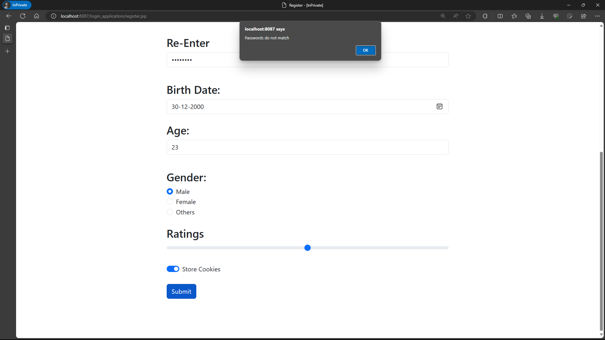
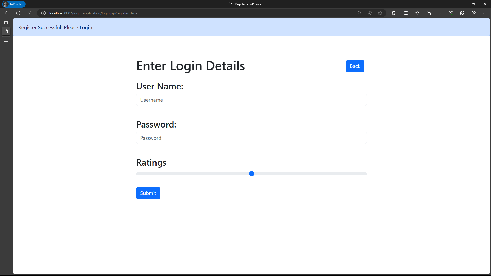
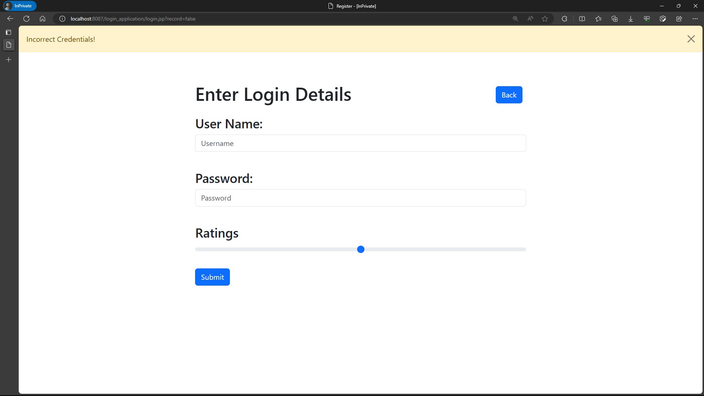
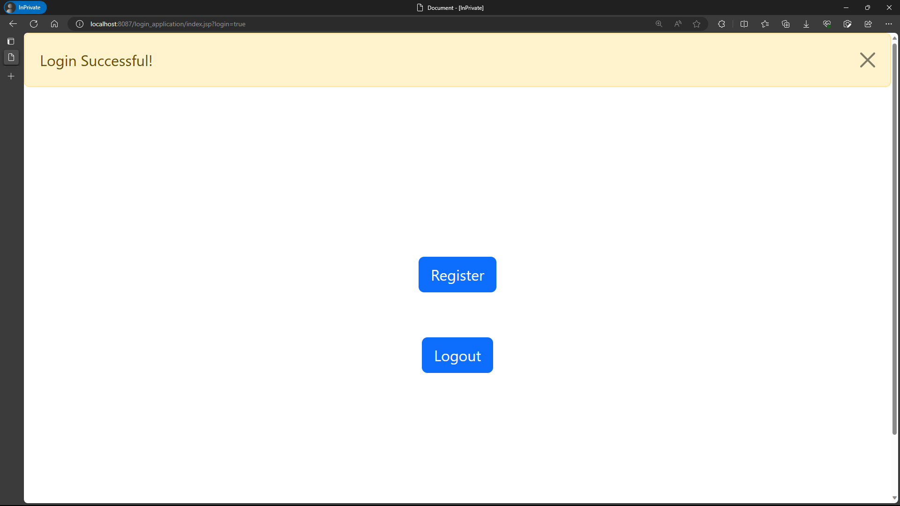
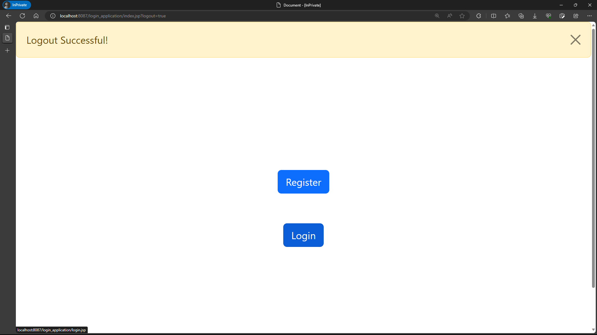
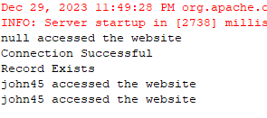

## Registeration and Login Application 

#### 1. Servlet Handlers
* [LoginHandler.java](./src/main/java/servlet_handlers/LoginHandler.java)
* [RegistrationHandler.java](./src/main/java/servlet_handlers/RegistrationHandler.java)

#### 2. Database Handlers
* [ConnectionSQLServer.java](./src/main/java/database_handlers/ConnectionSQLServer.java): provides a static method getServerConnection() which returns a java.sql.Connection object
* [CreateSQL.java](./src/main/java/database_handlers/CreateSQL.java): has a static method createTable(Connection) which creates a Person table and returns boolean variable based on success
* [InsertIntoTable.java](./src/main/java/database_handlers/InsertIntoTable.java): has a static method insertIntoPersons(Connection, Person) which inserts into table Person and returns boolean variable based on success
* [LoginRecordCheck.java](./src/main/java/database_handlers/LoginRecordCheck.java): handles the check of login credentials from LoginHandler.java
* [SelectTable.java](./src/main/java/database_handlers/SelectTable.java): has a static method selectQuery(Connection) which prints all the records in the Person table
* [Person.java](./src/main/java/database_handlers/Person.java): class to store, validate and hash the password user entered from RegisterationHandler.java

#### 3. JSP Files
* [index.jsp](./src/main/webapp/index.jsp)
* [register.jsp](./src/main/webapp/register.jsp)
* [login.jsp](./src/main/webapp/login.jsp)
* [logout.jsp](./src/main/webapp/logout.jsp)

#### 4. web.xml - [web.xml](./src/main/webapp/WEB-INF/web.xml)

Output -

* Landing index.jsp

    >

* Registeration

    >

    1. Javascript validation -

    >

    2. Successful registeration -

    >

* Login

    1. Entering incorrect credentials -
    
    >

    2. Successful Login -

    >

* Logout

    1. Logging out -

    >

    2. Accessing logout page when not logged in redirects to login.jsp page

    >

* Logging using sessions

    >