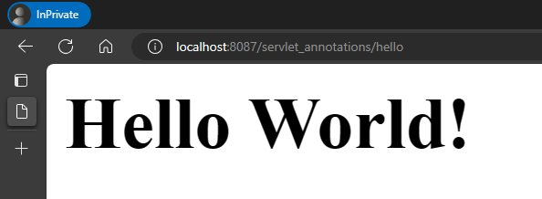
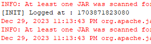
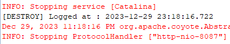

### Servlet using Annotations

#### 1. Hello World

Java Servlet File - [HelloWorld.java](./src/main//java/HelloWorld.java)

Annotation -

```
@WebServlet(value = "/hello",
			initParams = {
					@WebInitParam(name="message", value="Hello World!") 
					}
			)
```

Output -

> 

#### 2. Logging using Filter Class

Java Servlet File - [Logging.java](./src/main//java/Logging.java)

Annotation -

```
@WebFilter(urlPatterns = { "/*" })
```

Output -

>

>
