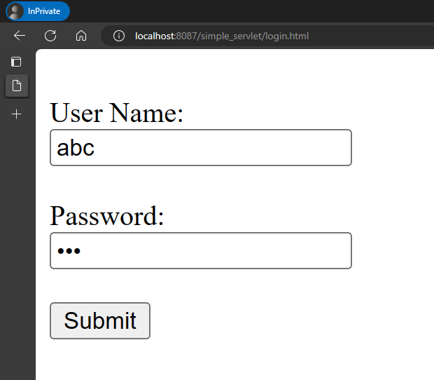
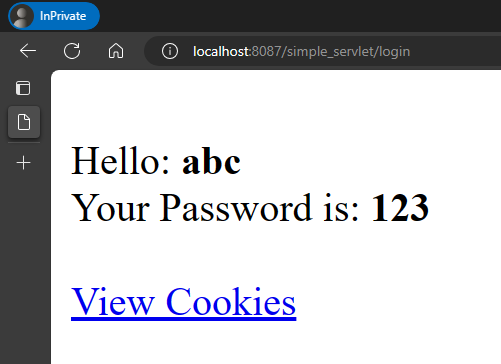
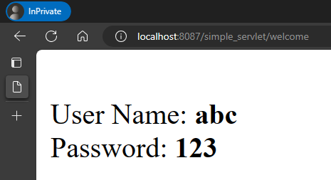

### Servlets

#### Simple Hello World Servlet

1. Java Servlet - [HelloWorld.java](./src/main/java/HelloWorld.java)
2. web.xml - [web.xml](./src/main/webapp/WEB-INF/web.xml)

Output -

>

#### Servlet with Login form and Cookies

1. Java Servlet files
    * [Login.java](./src/main/java/Login.java)
    * [Welcome.java](./src/main/java/Welcome.java)

2. HTML files
    * [login.html](./src/main/webapp/login.html)

Output -

>

>

>
